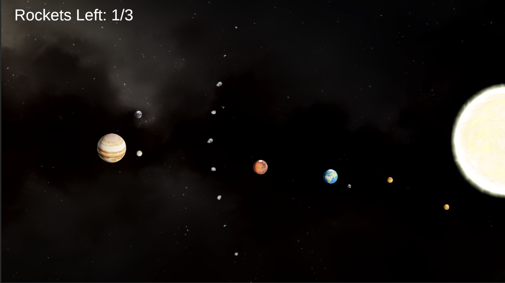

# Moonshot
A simple Unity game about shooting for the moon(s).

## About the Game

Hints of Unobtanium have been discovered on two of Jupiter's moons (Ganymede and Europa), and scientists on Earth have decided to launch an expedition to investigate. But something went terribly wrong, because now **you're** in charge of planning the launch and manoeuvring the rocket.

## Goal

- You are trying to successfully land a rocket on any one of Jupiter's moons. 
- Our own moon, Mars, the asteroid belt, and Jupiter are the major obstacles in your way.
- Thankfully, the scientists built three rockets so you don't need to get it right the first time.
- You can wait for the planets to be in the ideal points in their orbit, then aim and launch a rocket.
- The rockets do have thrusters that provide some manoeuvrability post-launch.
- The sun, the planets, and the moons do exert gravitational effects on the rocket.

## Controls

### Keyboard

Before launch:
- Y and H keys (sorry) to adjust the time of launch
- Mouse Cursor to aim the rocket's launch trajectory
- Spacebar or Left Mouse Button to launch the rocket

Post-Launch:
- Arrow keys or WSAD to use thrusters, to finely manoeuvre the rocket 
(motion is relative to rocket orientation)
- Escape to restart game after the Game Over Screen is shown

### Controller

Not Supported

### Other Notes

Since the objects on the screen are small, please play on as big a screen as possible, and on the Game tab, change the Play Focused setting to Play Maximized.
The orbits and sizes of the heavenly bodies are obviously not to scale, but the relative orbit periods are close approximations of real-life orbit periods.